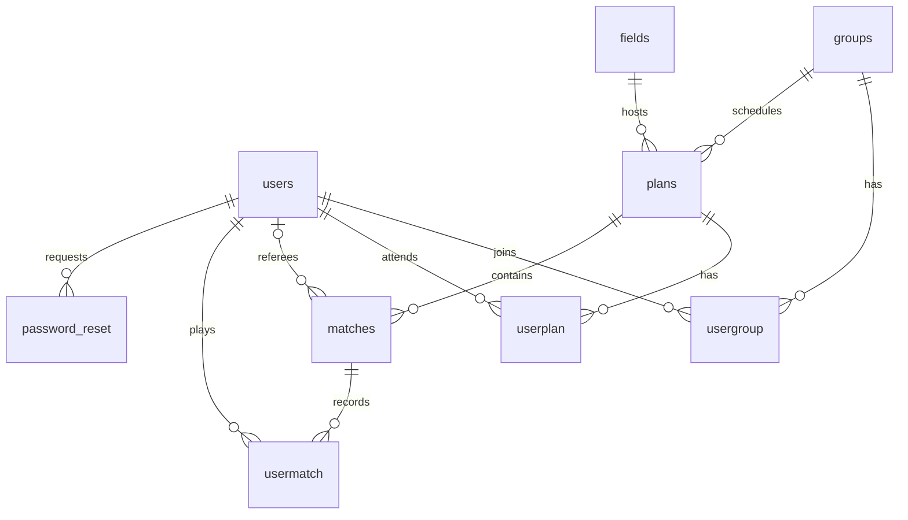

# 프로젝트 구조

분석 기준은 [문서 안내](README.md)의 커밋입니다. 아래는 현재 소스에 구현된 구조이며, 권장 변경은 [수정 순서](remediation.md)에 따로 적었습니다.

## 구성

| 영역 | 역할 | 근거 |
| --- | --- | --- |
| jokgu-server | NestJS HTTP API, TypeORM/MySQL, JWT, Socket.IO, 메일, cron | [package.json](../jokgu-server/package.json), [AppModule](../jokgu-server/src/app.module.ts#L18) |
| jokgu-front | React/Vite/TypeScript 화면, TanStack Query, Axios, React Hook Form, PWA | [package.json](../jokgu-front/package.json), [vite.config.ts](../jokgu-front/vite.config.ts) |
| 외부 서비스 | 네이버 지도와 지오코딩, 다음 주소 검색, 네이버 SMTP | [index.html](../jokgu-front/index.html), [FieldsService](../jokgu-server/src/fields/fields.service.ts#L24), [MailService](../jokgu-server/src/mails/mails.service.ts) |

HTTP 경로에는 /api 접두사가 붙습니다. 전역 JwtAuthGuard는 공개 핸들러를 제외한 HTTP 인증을 담당합니다. MySQL 연결의 timezone은 +09:00이고 synchronize는 false입니다. 이는 DB 세션 타임존이나 실제 DDL이 확인됐다는 의미는 아닙니다. [부트스트랩](../jokgu-server/src/main.ts), [DB 설정](../jokgu-server/src/app.module.ts#L22)

## 서버 모듈

| 모듈 | 역할과 주요 경로 | 진입 소스 |
| --- | --- | --- |
| users/auth | 가입, 로그인, 내 정보, 비밀번호 변경과 재설정 | [UsersController](../jokgu-server/src/users/users.controller.ts), [JwtAuthGuard](../jokgu-server/src/auth/jwt.guard.ts) |
| groups | 그룹 생성, 초대코드 조회, 가입 요청, 승인, 수정, 탈퇴, 그룹 일정 생성 | [GroupsController](../jokgu-server/src/groups/groups.controller.ts) |
| fields | 경기장 목록, 등록, 상세, 사용 일정 조회 | [FieldsController](../jokgu-server/src/fields/fields.controller.ts) |
| plans | 내 예정 일정, 상세, 삭제, 참가자, 경기 목록, 경기 등록 | [PlansController](../jokgu-server/src/plans/plans.controller.ts) |
| matches | 경기 상세와 참가자 결과, 경기 저장 서비스 | [MatchesController](../jokgu-server/src/matches/matches.controller.ts), [MatchesService](../jokgu-server/src/matches/matches.service.ts) |
| main | 오늘 일정과 관리 그룹 조회 | [MainController](../jokgu-server/src/main/main.controller.ts) |
| usergroup/userplan/usermatch | 연결 엔티티. 별도 서비스와 컨트롤러는 비어 있음 | [usergroup](../jokgu-server/src/usergroup/usergroup.service.ts), [userplan](../jokgu-server/src/userplan/userplan.service.ts), [usermatch](../jokgu-server/src/usermatch/usermatch.service.ts) |
| mails/scheduler | 재설정 코드 메일 발송, 만료 코드 삭제 | [MailService](../jokgu-server/src/mails/mails.service.ts), [CleanupService](../jokgu-server/src/scheduler/code.cleanup.service.ts) |
| websocket | 일정별 실시간 점수 방송과 메모리 캐시 | [ScoreGateway](../jokgu-server/src/websocket/score.gateway.ts) |

조회는 raw SQL, 저장은 TypeORM repository와 raw SQL을 함께 씁니다. 그룹 생성, 일정 생성, 경기 생성은 부모 행과 연결 행을 순서대로 저장하며 전체 작업을 하나의 트랜잭션으로 묶지 않습니다.

## 데이터 관계

다음은 엔티티와 쿼리에서 읽은 논리 관계입니다. 실제 DB의 FK, unique 제약, default와 삭제 정책은 별도 확인 대상입니다.

- [users](../jokgu-server/src/users/entities/user.entity.ts): username, 비밀번호 해시, 이름, 연락 정보, is_active.
- [usergroup](../jokgu-server/src/usergroup/entity/usergroup.entity.ts): 사용자와 그룹, role은 admin/member/pending.
- [plans](../jokgu-server/src/plans/entity/plan.entity.ts): 그룹, 경기장, 이름, DATE 날짜, TIME 시작 시각.
- [userplan](../jokgu-server/src/userplan/entity/userplan.entity.ts): 일정 참가자.
- [matches](../jokgu-server/src/matches/entity/match.entity.ts): 일정, 선택적 심판, 승리 팀 A/B, single/Bo3 방식, 생성 시각.
- [usermatch](../jokgu-server/src/usermatch/entity/usermatch.entity.ts): 사용자별 경기 승패. 개별 득점 이력은 저장하지 않습니다.
- [password_reset](../jokgu-server/src/users/entities/password-reset.entity.ts): 사용자, 코드, 사용 여부, 만료 시각.

## 인증과 비밀번호 재설정

1. signup은 필수값과 username 중복을 확인하고 bcrypt로 해시한 뒤 저장합니다.
2. login은 사용자 활성 상태와 비밀번호를 확인하고 id, username을 담은 JWT를 발급합니다. 기본 만료는 1일입니다.
3. 프론트는 토큰을 sessionStorage에 저장하고 Axios가 Authorization Bearer 헤더를 붙입니다. CheckToken은 토큰 존재만 검사합니다.
4. HTTP 전략은 JWT payload를 req.user로 돌려주며 사용자 활성 상태나 그룹 역할을 DB에서 다시 확인하지 않습니다.
5. 공개 경로는 POST login, POST signup, GET searchemail, POST sendresetcode, POST verifycode입니다. 모두 /api/users 아래에 있습니다.
6. 재설정 코드 발송은 이메일로 사용자를 찾고 5분 뒤 만료 시각을 저장합니다. 코드 확인은 username과 email로 찾은 사용자에게 10분 JWT를 발급합니다.
7. 재설정 JWT는 로그인 JWT와 payload 형태 및 키가 같습니다. resetpassword는 토큰 용도를 따로 구분하지 않습니다.

근거: [UsersService](../jokgu-server/src/users/users.service.ts), [UsersModule](../jokgu-server/src/users/users.module.ts#L19), [JwtStrategy](../jokgu-server/src/auth/jwt.strategy.ts#L15), [Axios](../jokgu-front/src/api/axios.ts), [App](../jokgu-front/src/App.tsx#L62).

CleanupService의 cron 식은 0 0 * * *이며 만료 코드를 지웁니다. 모듈과 provider 등록은 존재합니다. 명시적 타임존 옵션과 실제 실행 증거는 없습니다.

## 프론트 화면

| 경로 | 화면 |
| --- | --- |
| /login, /signup | 로그인, 가입 |
| /verifycode, /resetpassword | 재설정 코드 확인, 새 비밀번호 |
| /main, /mypage, /pwd | 대시보드, 내 정보, 비밀번호 변경 |
| /fields, /fields/create, /fields/:fid | 경기장 목록, 등록, 상세 |
| /groups, /groups/create, /groups/:gid | 그룹 목록, 생성, 상세 |
| /groups/:gid/create | 일정 생성 |
| /plans, /plans/:pid | 예정 일정, 일정 상세와 정산 |
| /plans/:pid/newmatch | 팀 구성, 득점, 경기 결과 저장 |
| /plans/:pid/matches/:mid | 경기 결과 상세 |

전체 라우트는 [App.tsx](../jokgu-front/src/App.tsx#L30)에 있습니다. /는 /main으로 이동합니다. 내 정보의 탈퇴 버튼은 서버에 없는 POST /users/deactivate를 호출합니다.

## 실시간 점수

| 이벤트 | 방향 | 현재 동작 |
| --- | --- | --- |
| 연결 인증 | 클라이언트에서 서버 | handshake.auth.token의 JWT를 한 번 검증 |
| join(pid) | 클라이언트에서 서버 | 이전 일정 방을 나가고 pid 방에 입장, 캐시가 있으면 nowScore 전송 |
| updateScore({pid, score}) | 클라이언트에서 서버 | 캐시 저장 후 해당 방에 nowScore 방송 |
| nowScore(score) | 서버에서 클라이언트 | 현재 점수와 세트 점수 전달 |
| leave(pid) | 클라이언트에서 서버 | 방 퇴장. 현재 프론트에서 호출하지 않음 |
| matchEnd(pid) | 클라이언트에서 서버 | 캐시 삭제 후 방에 matchEnd 방송 |
| matchEnd | 서버에서 클라이언트 | 시청자 점수 표시 제거 |

score는 aScore, bScore, aSetScore, bSetScore로 구성됩니다. 타입 선언만 있고 런타임 값 검증은 없습니다. 캐시는 프로세스의 Map이며 TTL, 기록자 소유권, disconnect 정리가 없습니다.

기록 화면은 로컬 상태로 승자를 결정하고 REST로 winner, referee, game, A, B를 저장합니다. 시청 화면은 nowScore를 표시합니다. 실시간 점수 방송 자체는 저장된 경기 결과를 변경하지 않습니다. [MatchCreate](../jokgu-front/src/pages/matches/MatchCreate.tsx#L112), [PlanDetail](../jokgu-front/src/pages/plans/PlanDetail.tsx#L39)

## 설정과 실행 전제

- 서버: DB_HOST, DB_PORT, DB_USERNAME, DB_PASSWORD, DB_DATABASE, JWT_SECRET, SERVER_PORT, CORS_ORIGIN.
- 외부 서비스: MAIL_USER, MAIL_PASSWORD, NAVER_CLIENT_ID, NAVER_CLIENT_KEY.
- 프론트: VITE_BASE_URL, VITE_WEBSOCKET_URL. HTTP API 접두사와 baseURL의 조합을 맞춰야 합니다.
- 서버 package.json에 build, start:dev, start:prod, test, test:e2e가 있습니다. 프론트에는 dev, build, lint, preview가 있습니다.
- 실행 환경 파일, DB DDL과 migration, 배포 파이프라인은 저장소에서 확인하지 못했습니다. 이 문서는 정상 기동을 보장하는 설치 가이드가 아닙니다.

[문서 안내](README.md) / [분석 항목](findings.md) / [수정 순서](remediation.md)
